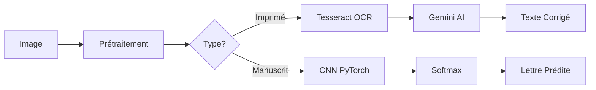

<p align="center">
  
  
  
  
  
</p>

<h1 align="center">
  OCR-University-Project
</h1>

<p align="center">
  <strong>Reconnaissance Optique et Intelligente de Caractères</strong><br>
  <em>Une solution complète combinant OCR classique et Deep Learning pour la reconnaissance de texte</em>
</p>

<p align="center">
  <a href="#-à-propos">À Propos</a> •
  <a href="#-fonctionnalités">Fonctionnalités</a> •
  <a href="#-architecture">Architecture</a> •
  <a href="#-installation">Installation</a> •
  <a href="#-utilisation">Utilisation</a> •
  <a href="#-équipe">Équipe</a>
</p>

---

## À Propos

Ce projet propose une **suite complète d'outils** pour la reconnaissance de caractères, combinant :

| Module | Technologie | Description |
|--------|-------------|-------------|
| **OCR** | Tesseract + Gemini AI | Reconnaissance de texte imprimé multilingue avec correction IA |
| **ICR** | CNN PyTorch | Reconnaissance de caractères manuscrits via Deep Learning |

---

## Fonctionnalités

### Module OCR — Tesseract + Google Gemini

<table>
<tr>
<td width="50%">

**Extraction de Texte**
- Support multilingue (Français, Arabe, Anglais)
- Prétraitement d'image automatique
- Détection automatique du type de document

</td>
<td width="50%">

**Intelligence Artificielle**
- Correction par Google Gemini AI
- Amélioration orthographique et grammaticale
- Classification intelligente des documents

</td>
</tr>
</table>

### Module ICR — Deep Learning

<table>
<tr>
<td width="50%">

**Reconnaissance CNN**
- Architecture 3 blocs convolutionnels
- Précision > 90% (Top-5 > 98%)
- Prédiction en temps réel

</td>
<td width="50%">

**Interface Utilisateur**
- Canvas de dessin interactif
- Affichage Top-5 des prédictions
- Export des résultats

</td>
</tr>
</table>

---

## Architecture

```
OCR-University-Project/
├── V1/                              # Module OCR + IA
│   ├── OCR_V1.py                    # Application OCR avec Gemini
│   ├── .env                         # Configuration API (Gemini Key)
│   └── requirements.txt
│
├── V2/                              # Module ICR (Deep Learning)
│   ├── icr_gui_app.py               # Application GUI PyQt5
│   ├── icr_cnn_model.pth            # Modèle CNN entraîné
│   ├── ICR_v1_jupyter.ipynb         # Notebook d'entraînement
│   └── requirements.txt
│
└── README.md
```

### Pipeline de Traitement



---

## Installation

### Prérequis Système

| Logiciel | Version | Lien |
|----------|---------|------|
| Python | 3.10+ | [python.org](https://python.org) |
| Tesseract OCR | 5.0+ | [GitHub](https://github.com/UB-Mannheim/tesseract/wiki) |
| CUDA (optionnel) | 11.8+ | [nvidia.com](https://developer.nvidia.com/cuda-downloads) |

### Installation Rapide

```bash
# 1. Cloner le repository
git clone https://github.com/aoulichak/OCR-University-Project.git
cd OCR-University-Project

# 2. Créer un environnement virtuel
python -m venv venv
source venv/bin/activate  # Linux/Mac
# ou
.\venv\Scripts\activate   # Windows

# 3. Installer les dépendances
pip install -r V1/requirements.txt
pip install -r V2/requirements.txt
```

### Configuration Tesseract (Windows)

```bash
# Installer Tesseract dans le chemin par défaut
C:\Program Files\Tesseract-OCR\tesseract.exe

# Installer les packs de langues
# fra.traineddata, ara.traineddata, eng.traineddata
```

### Configuration Google Gemini API

```bash
# Créer le fichier .env dans le dossier V1/
echo "GEMINI_API_KEY=votre_cle_api" > V1/.env
```

> Obtenez votre clé API sur [Google AI Studio](https://makersuite.google.com/app/apikey)

---

## Utilisation

### Lancer l'OCR avec Gemini AI

```bash
cd V1
python OCR_V1.py
```

<details>
<summary>Capture d'écran OCR</summary>

L'interface permet de :
1. Charger une image contenant du texte
2. Sélectionner les langues de reconnaissance
3. Appliquer la correction IA
4. Exporter le texte corrigé

</details>

### Lancer l'ICR (Reconnaissance Manuscrite)

```bash
cd V2
python icr_gui_app.py
```

<details>
<summary>Capture d'écran ICR</summary>

L'interface permet de :
1. Dessiner une lettre à la souris
2. Obtenir les 5 meilleures prédictions
3. Visualiser le niveau de confiance
4. Effacer et recommencer

</details>

---

## Performances

| Métrique | Module OCR | Module ICR |
|----------|------------|------------|
| **Précision** | Élevée (avec Gemini) | > 90% |
| **Top-5 Accuracy** | N/A | > 98% |
| **Langues** | FR, AR, EN | A-Z (26 classes) |
| **Temps de réponse** | ~2-3s | < 100ms |

### Architecture CNN (ICR)

| Couche | Type | Output Shape | Paramètres |
|--------|------|--------------|------------|
| Input | — | (1, 28, 28) | 0 |
| Conv Block 1 | Conv+BN+ReLU+Pool | (32, 14, 14) | 320 |
| Conv Block 2 | Conv+BN+ReLU+Pool | (64, 7, 7) | 18,496 |
| Conv Block 3 | Conv+BN+ReLU+Pool | (128, 3, 3) | 73,856 |
| FC1 | Linear+ReLU+Dropout | (256,) | 295,168 |
| FC2 | Linear | (26,) | 6,682 |
| **Total** | | | **394,522** |

---

## Documentation

- **Notebook Entraînement** : [ICR_v1_jupyter.ipynb](V2/ICR_v1_jupyter.ipynb)

---

## Technologies Utilisées

<p align="center">
  
  
  
  
  
  
</p>

---

## Équipe

<table align="center">
  <tr>
    <td align="center">
      <br/>
      <sub>Développeur Full-Stack</sub>
    </td>
  </tr>
</table>

<p align="center">
  <br/>
  <sub>Encadrante du Projet</sub>
</p>

---

## Contexte Académique

<p align="center">
  <strong>Université Hassan Premier</strong><br/>
  Faculté des Sciences et Techniques de Settat<br/>
  Département d'Informatique<br/>
  <em>Décembre 2025</em>
</p>

---

## Licence

Ce projet est sous licence MIT. Voir le fichier [LICENSE](LICENSE) pour plus de détails.

---

## Remerciements

- **Google** pour l'API Gemini AI
- **Tesseract OCR** pour le moteur de reconnaissance
- **PyTorch** pour le framework Deep Learning
- **EMNIST & Kaggle** pour les datasets d'entraînement

---

<p align="center">
  <strong>If this project was helpful, consider giving it a star!</strong>
</p>

<p align="center">
  
  
</p>
